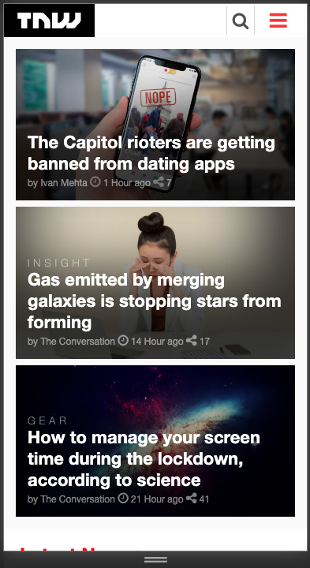
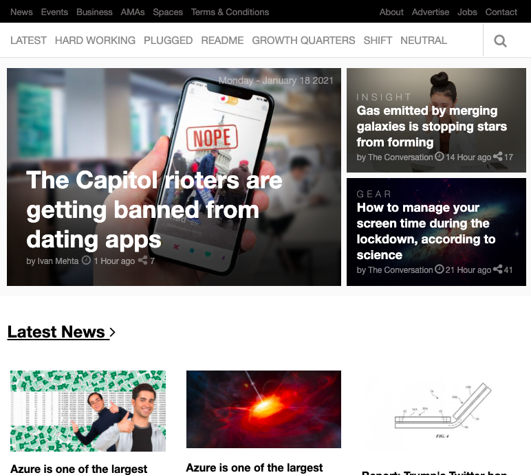
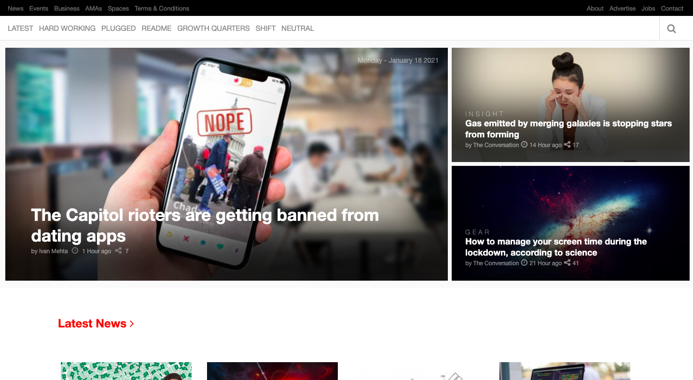

# tnw-clone

> TheNextWeb clone using html and css !only

## Built with

- HTML
- CSS

## Live Demo

[Live Demo Link](https://juxsalley.github.io/tnw-clone/)

working on this project, you will learn the basic use of css flex-box and css grid and how to use it's adantages to layout elements on a web page and make it responsive

### Prerequisites

- Text Editor
- internet brower

### Setup

- git clone <link-of-the-repo>
- cd repo-folder
- open in browser

### Install

- No instalation required!

## Authors

👤 **Author1**

- GitHub: [@githubhandle](https://github.com/juxsalley)
- Twitter: [@__salley](https://twitter.com/__salley)
- LinkedIn: [LinkedIn](https://www.linkedin.com/in/dev-salley/)

👤 **Author2**

- GitHub: [@githubhandle](https://github.com/mahtsham)
- LinkedIn: [LinkedIn](https://www.linkedin.com/in/muhammad-ahtsham)
- Twitter: [@Muhamma69639448](https://twitter.com/Muhamma69639448)

## 📝 License

This project is [MIT](./LICENSE) licensed.
